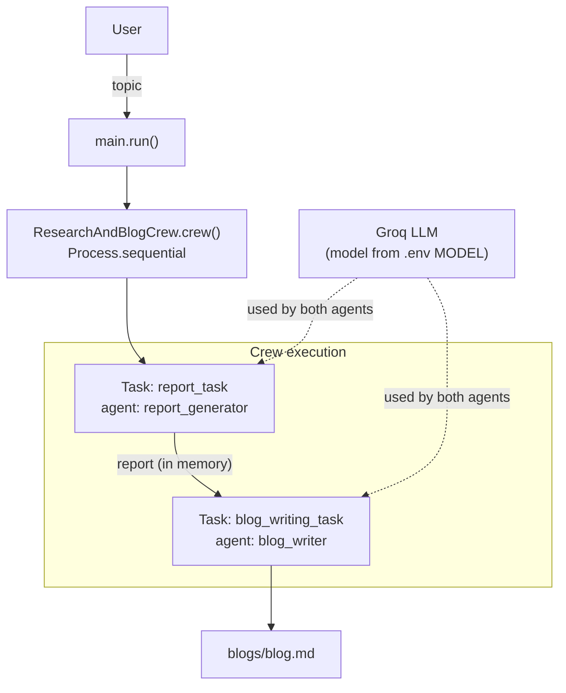

# Research & Blog Crew

Part of [ReWrite](../README.md) — this is the crewAI agent pipeline on its own, usable
standalone (CLI) or imported directly by `backend/`.

A two-agent [crewAI](https://crewai.com) pipeline that takes a topic, researches it into a
detailed report, then rewrites that report as a short, fun, easy-to-read blog post — all
powered by a single Groq-hosted LLM.

## How it works

Give it a topic (e.g. `"Quantum Computing"`) and two agents run one after another in a single
sequential crew:

1. **Report Generator** researches the topic and writes a ~2000-word structured report
   (facts, trends, analogies) — kept in memory, not saved to disk.
2. **Blog Writer** takes that report and rewrites it as a ~500-word blog post simple enough
   for a 5-year-old to follow, with a fun heading.

The blog is written to [blogs/blog.md](blogs/blog.md). No intermediate `report.md` file is
produced — the report only exists as the input handed from the first agent's task to the second.



## Tech stack

| Layer            | Tech                                                              |
|-------------------|-------------------------------------------------------------------|
| Agent framework  | [crewAI](https://docs.crewai.com) (`crewai[tools]`)                |
| LLM provider     | [Groq](https://groq.com) (via `crewai.LLM` / [LiteLLM](https://docs.litellm.ai/)) |
| Language         | Python 3.10 – 3.12                                                 |
| Dependency mgmt  | [uv](https://docs.astral.sh/uv/)                                   |
| Config           | YAML (`agents.yaml`, `tasks.yaml`) + `.env`                        |
| Build backend    | Hatchling                                                          |

## Model configuration

The LLM is **not** hardcoded in the agent YAML. `crew.py` builds one shared `LLM` instance from
the `MODEL` environment variable and injects it into both agents:

```python
llm = LLM(model=os.environ["MODEL"])
```

Your `.env` file (not committed) needs:

```
GROQ_API_KEY=your-groq-api-key
MODEL=groq/openai/gpt-oss-120b
```

`MODEL` must be a model string LiteLLM recognizes in `provider/model` form (e.g.
`groq/llama-3.3-70b-versatile`, `groq/openai/gpt-oss-120b`) and one your Groq account actually
has access to — an invalid or unavailable model name fails with a `litellm.NotFoundError` at
kickoff time, not at startup.

## Project structure

```
src/research_and_blog_crew/
├── main.py                  # CLI entrypoint: run(topic=None) — prompts for a topic if omitted
├── crew.py                  # ResearchAndBlogCrew: agents, tasks, LLM wiring, crew assembly
├── config/
│   ├── agents.yaml           # report_generator & blog_writer: role/goal/backstory
│   └── tasks.yaml            # report_task & blog_writing_task: description/expected_output
└── tools/
    └── custom_tool.py         # unused example tool template (no tools are wired to any agent)
blogs/
└── blog.md                   # output of the last run
knowledge/
└── user_preference.txt        # sample knowledge file, still has placeholder content
```

## Setup

Requires Python >=3.10,<3.13 and [uv](https://docs.astral.sh/uv/).

```bash
pip install uv
uv sync
```

Create a `.env` file in the project root with `GROQ_API_KEY` and `MODEL` as shown above.

## Running the project

Run it and you'll be prompted for a topic:

```bash
uv run run_crew
# Enter a topic for the report and blog: Quantum Computing
```

`crewai run` works the same way (it shells out to `uv run run_crew` internally).

To run it programmatically with a fixed topic (no prompt), e.g. from another script:

```python
from research_and_blog_crew.main import run
run("Quantum Computing")
```

The result is written to `blogs/blog.md`, overwriting the previous run's output.

## Known limitations

- `pyproject.toml` also exposes `train`, `replay`, and `test` scripts pointing at
  `main.train` / `main.replay` / `main.test`, but `main.py` only implements `run()` —
  those three commands will fail with an `ImportError` if invoked.
- `tools/custom_tool.py` is the unmodified crewAI example tool and isn't attached to either
  agent — both agents currently rely on the LLM's own knowledge only, with no web search or
  other tool access.
- `knowledge/user_preference.txt` still contains the crewAI template's placeholder ("John Doe")
  content rather than real user preferences.
